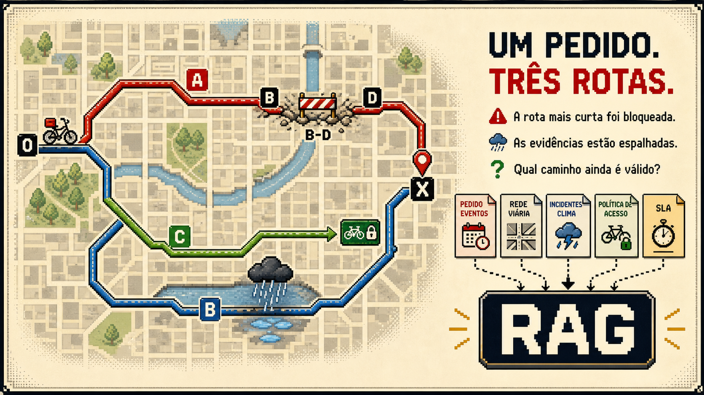
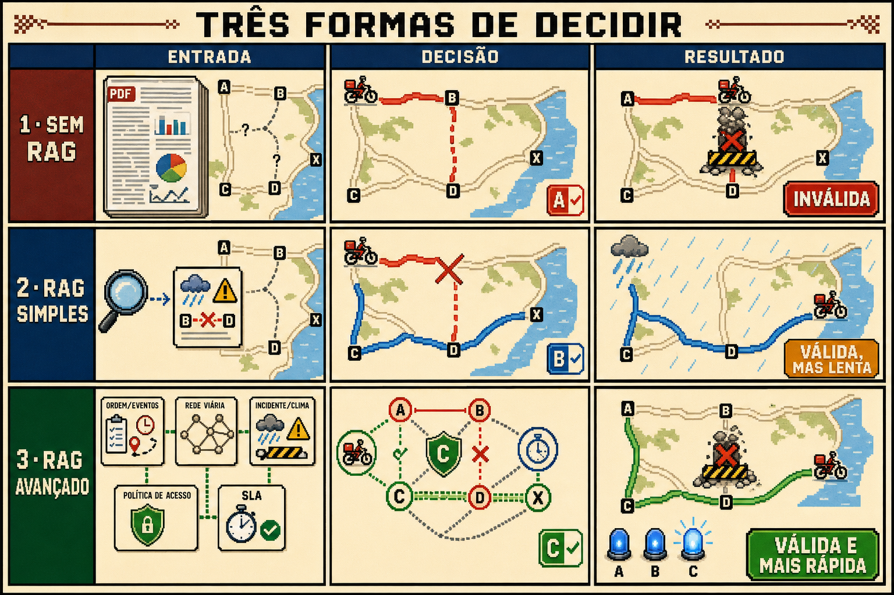
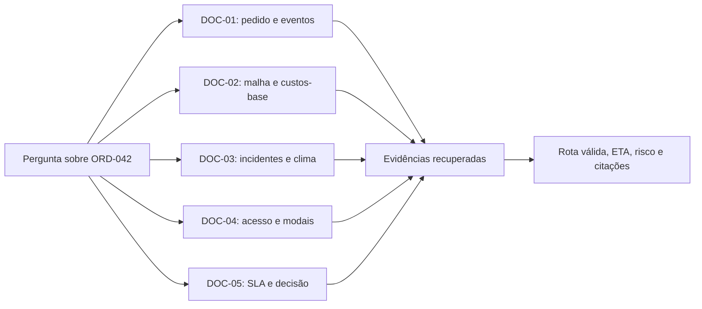

# Last Mile RAG Lab

<div align="center">

**Benchmark reproduzível de RAG aplicado a decisões logísticas sob restrições dinâmicas.**


</div>

## Objetivo

O **Last Mile RAG Lab** investiga como diferentes estratégias de recuperação alteram a qualidade,
o custo e a rastreabilidade de decisões logísticas. O cenário exige escolher uma rota válida para um
pedido a partir de informações fragmentadas entre pedidos, malha, incidentes, políticas e SLA.

O projeto será desenvolvido em três níveis comparáveis:

1. Contexto completo sem recuperação.
2. RAG vetorial simples.
3. RAG híbrido com filtros temporais, reranking e ferramentas determinísticas.

Esta primeira versão entrega somente a fundação documental. Pipeline, avaliação, interface e integração
com Arduino serão adicionados depois que o contrato do corpus estiver estabilizado.

## O problema em duas imagens

### 1. O desafio



Um pedido precisa chegar ao destino, mas a rota aparentemente mais curta foi bloqueada. As evidências
para encontrar uma alternativa estão espalhadas entre documentos de pedido, malha, incidente, política
de acesso e SLA. O RAG deve recuperar e conectar essas informações antes de recomendar o caminho.

### 2. O experimento



A grade resume a hipótese do caso canônico: sem recuperação, a decisão falha no bloqueio; o RAG simples
encontra um desvio válido, porém lento; o RAG avançado combina as cinco fontes e revela uma rota permitida
e mais rápida. O benchmark medirá se cada pipeline realmente sustenta esse resultado com evidências.

## Problema central

O caso de referência acompanha o pedido sintético `ORD-042`. A aplicação deverá responder:

> Qual rota operacionalmente válida minimiza o tempo estimado, considerando o estado do pedido,
> o modal, a malha vigente, incidentes ativos, acessos temporários e o SLA?

Nenhuma fonte isolada contém a resposta completa.



## Corpus v0.1

| Documento | Papel | Páginas |
|---|---|---:|
| [Dossiê operacional de pedidos](data/corpus/documents/01-dossie-operacional-de-pedidos.pdf) | Estado, modal, promessa, eventos e qualidade dos dados | 10 |
| [Catálogo da malha logística](data/corpus/documents/02-catalogo-da-malha-logistica.pdf) | Nós, segmentos, rotas candidatas e custos-base | 8 |
| [Boletins operacionais](data/corpus/documents/03-boletins-operacionais.pdf) | Bloqueios, clima, penalidades e versões | 8 |
| [Políticas de acesso e modais](data/corpus/documents/04-politicas-de-acesso-e-modais.pdf) | Elegibilidade, janelas e regras temporais | 8 |
| [Manual de SLA e decisões](data/corpus/documents/05-manual-de-sla-e-decisoes.pdf) | Validade, risco, priorização, abstenção e ação | 8 |

Os documentos são textuais e pesquisáveis. O conteúdo inclui IDs semelhantes, outras regiões,
duplicidades, eventos fora de ordem e versões revogadas para evitar uma recuperação trivial.

## Perguntas de pesquisa

- Quanto contexto o RAG elimina em comparação com o PDF completo?
- Busca vetorial simples recupera todas as restrições necessárias?
- Filtros por região, horário e versão reduzem erros de grounding?
- Reranking melhora a cobertura de evidências multi-documento?
- Modelos menores conseguem raciocinar corretamente quando recebem evidências melhores?
- Qual é o impacto em acurácia, citações, latência, tokens e custo?

## Estrutura

```text
.
|-- data/
|   `-- corpus/
|       |-- documents/          # cinco PDFs usados como fonte
|       `-- manifest.json       # contrato e metadados do corpus
|-- tools/
|   |-- generate_document_01.py
|   |-- generate_documents_02_05.py
|   `-- validate_corpus.py
|-- .gitignore
|-- LICENSE
|-- README.md
`-- requirements.txt
```

## Reproduzir os documentos

```bash
python -m venv .venv
pip install -r requirements.txt
python tools/generate_document_01.py
python tools/generate_documents_02_05.py
python tools/validate_corpus.py
```

## Princípios do dataset

- Todos os dados são sintéticos e determinísticos.
- Nenhum nome, endereço, pedido ou identificador pertence a uma pessoa ou operação real.
- O formato é inspirado em padrões públicos de sistemas orientados a eventos e operações logísticas.
- O projeto é independente e não possui associação oficial com iFood, Bosch ou qualquer plataforma de entrega.
- A LLM não será tratada como fonte de verdade para redução de eventos ou cálculo de menor caminho.

## Autor

Desenvolvido por **Caio Leandro de Moraes** como estudo de RAG, avaliação de LLMs, logística e sistemas embarcados.

[LinkedIn](https://www.linkedin.com/in/caio-moraes-5687-/)
